## Procedure

Follow the instructions given below to perform the experiments:-

### 1.1 Starting Experiment 3 :-

- Step 1:-Click on the button START. A page appears with a dialogue box asking for your name. Enter your name and click OK.

    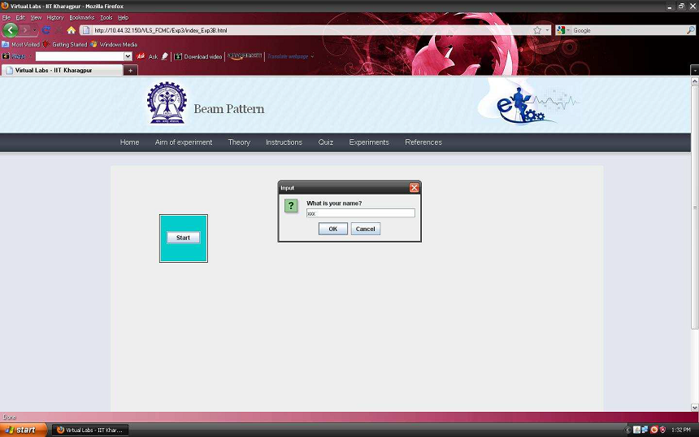  
      

      
### 1.2 Performing the Experiment 3A:-

- Step 2:-Choose the experiment you want to perform by clicking on the button EXPT 3A or EXPT 3B.
- 

    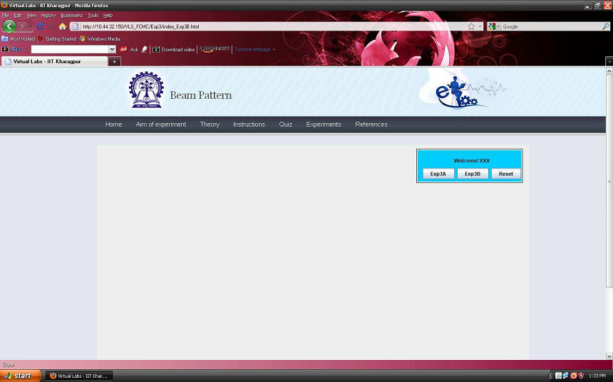  
      

      
- Step 3:-Place the mobile at different locations from the base station by adjusting the slider. You can also use the buttons + and - to change the position of the mobile.

- Step 4:-Record the values at different positions of the mobile by clicking on the button TAKE READING. Take 20 readings.

    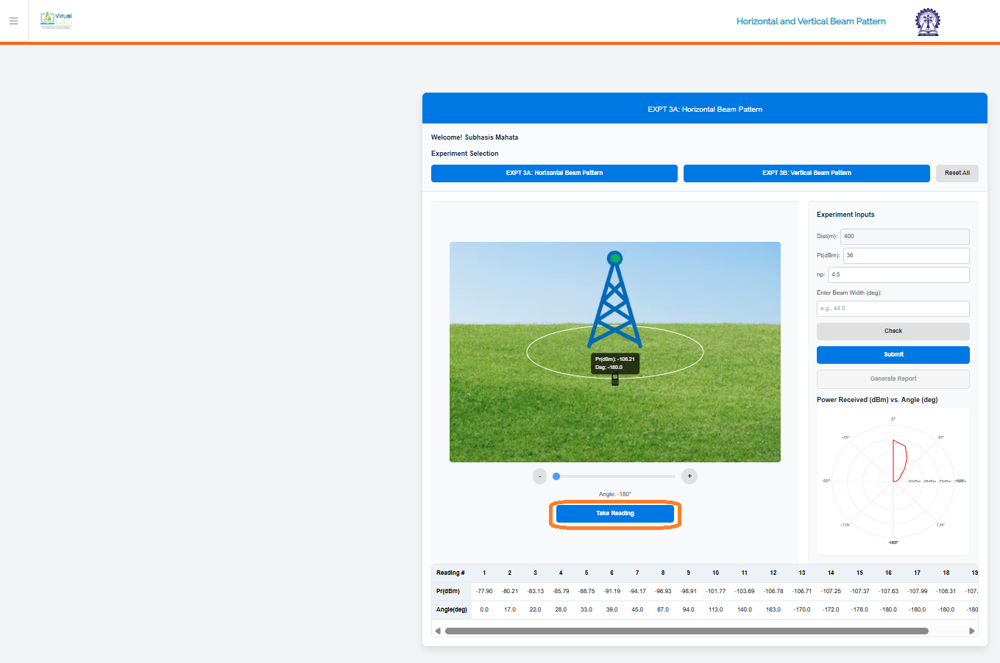  
      

      
- Step 5:-You can observe the plot of power received vs angle on the RHS of the page.

- Step 6:-Now note the points where there is 3 dB fall of received power and calculate the beam-width by following the example given in procedure section.

- Step 7:-Enter your calculated value of beam-width in the box provided in the RHS of the page.

- Step 8:-Click on the button SUBMIT to verify whether your manually calculated value of beam-width matches the computed value of beam-width. The exact value of beam-width is returned.

      
      

    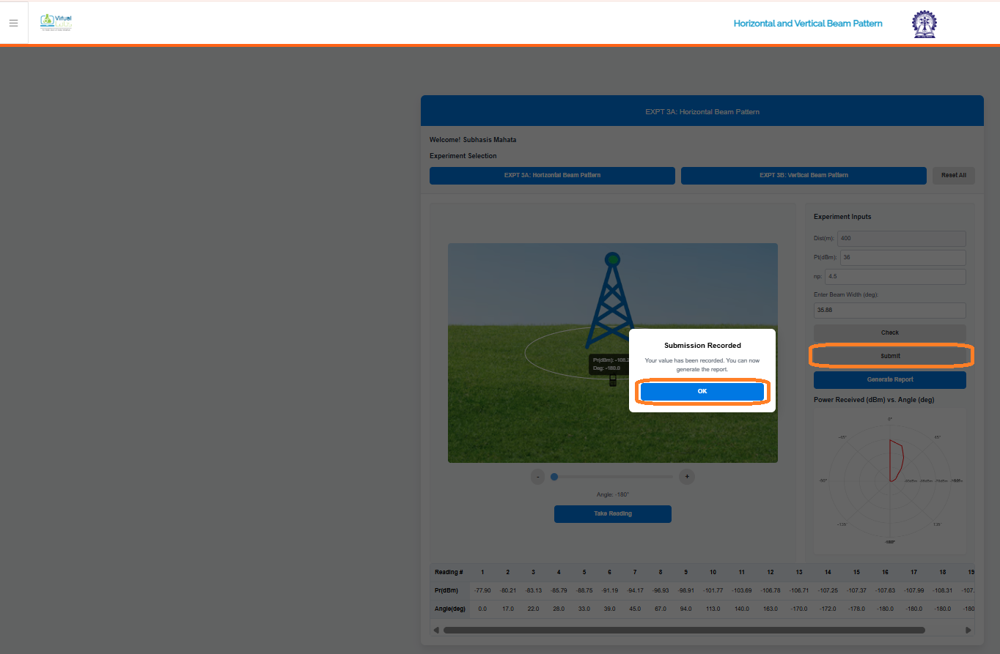  
      

      
### 1.3 Generating the report :-

- Step 9:-Click on the button REPORT to generate the report of your experiment.

    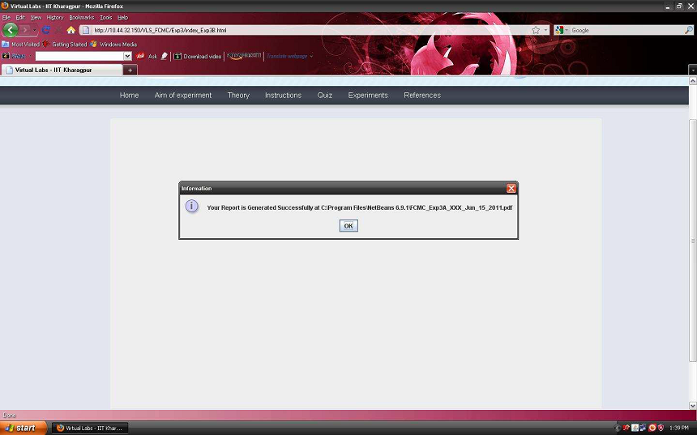  
      

      
- Step 11:-A dialogue box appears with the message that your report is successfully generated.

    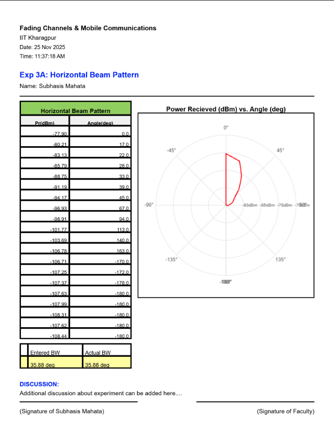  
      

      
- Step 12:-Finally,you can view the pdf report of the experiment you have done.      
- Step 13:-You can redo the entire experiment by clicking on the button RESET.

### 1.4 Performing the experiment 3B:-

- Step 14:-Follow the Step 2 as in experiment 3A.

- Step 15:-You can choose either random tilt or adjust the tilt value as given in the RHS of the page.

    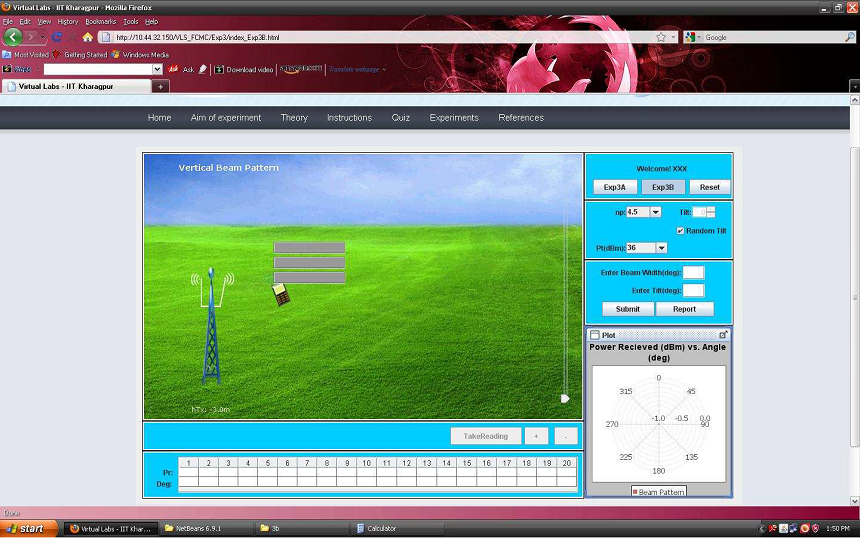  
      

      
- Step 16:-Drag the mobile and place the mobile at different locations from the base stations by adjusting the slider. You can also use the buttons + and - to change the position of the mobile.

- Step 17:- Record the values at different positions of the mobile by clicking on the button TAKE READING. Take 20 readings.

    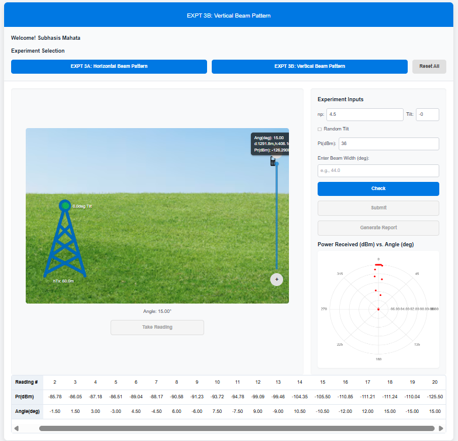  
      

      
- Step 18:-Now note the points where there is 3 dB fall of received power and calculate the beam-width by following the example given in procedure section. Observe the angle value at which received power is maximum.This is the tilt angle value.

- Step 19:-Enter your calculated value of beam-width and tilt in the box provided in the RHS of the page.

    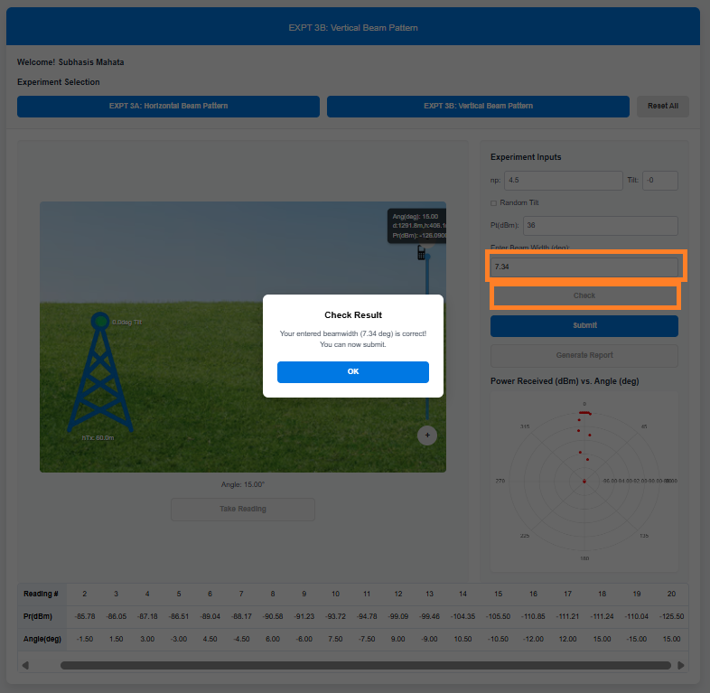  
      

    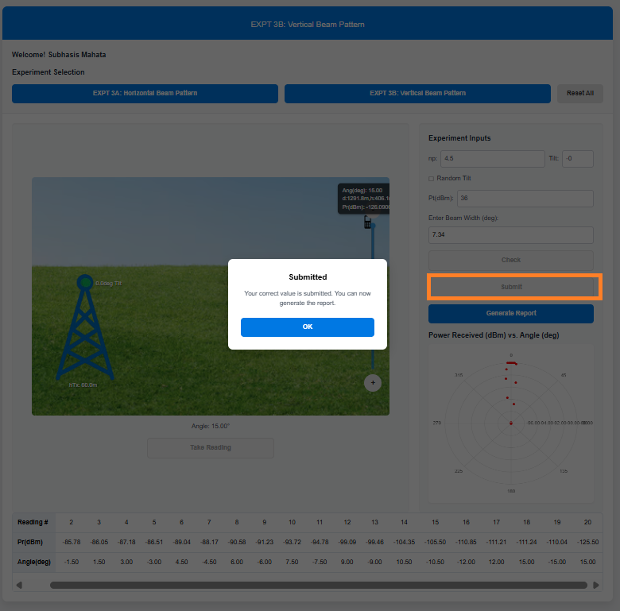  
      

      
### 1.5 Generating the report :-

- Step 20:- Follow Steps 9 to 12 to generate the pdf report of the experiment you have done.

    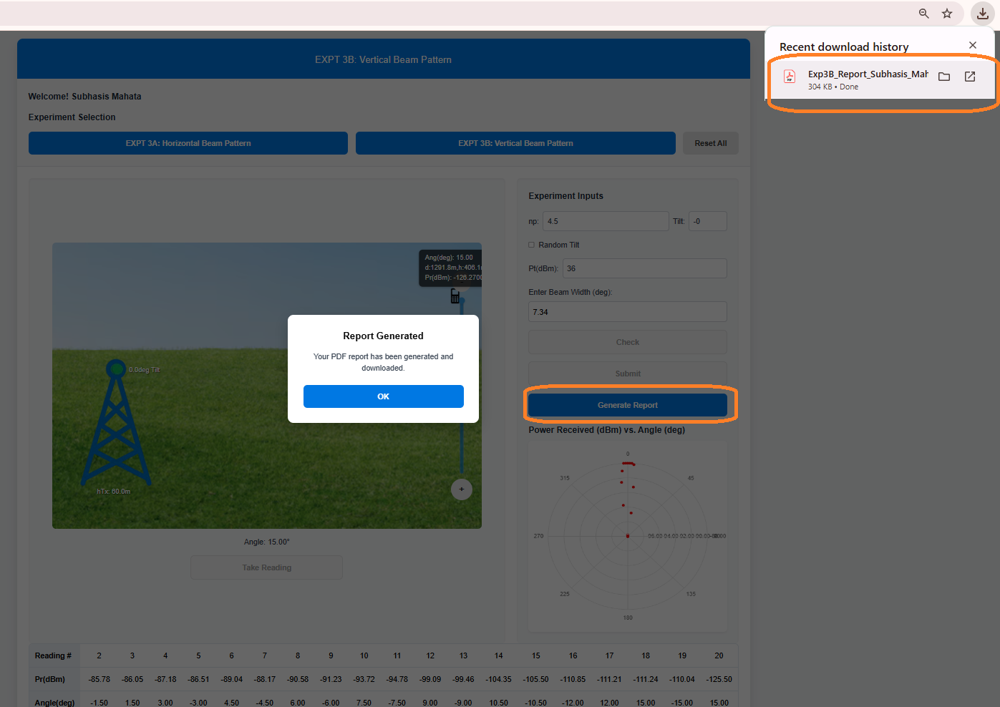  
      

      

    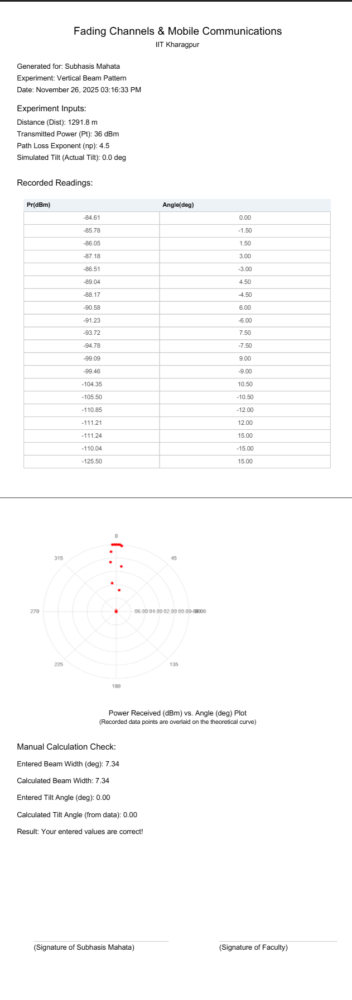  
      

      
- Step 21:-You can redo the entire experiment by clicking on the button RESET.

    
