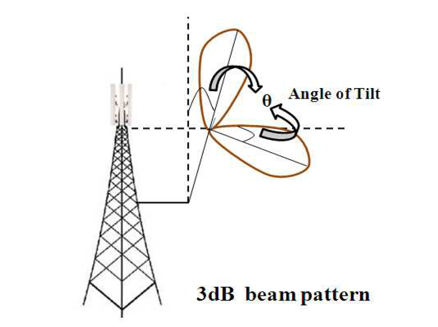
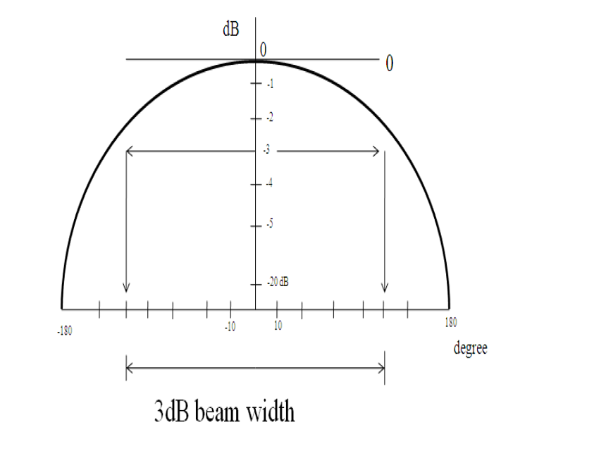

## Theory
**Introduction:**  

The antennas used at the base station of a cellular system play an important role in determining the coverage area, the interference, and hence the quality of service (signal strength) experienced by the user equipment in the downlink. It plays a similar role in the uplink. An omnidirectional antenna is simple to use compared to a directive antenna. Directive antennas limit the radiated signal power to a specific direction. This helps in reducing spatial interference and increasing capacity through sectoring.

A horizontal antenna pattern is used to obtain sectoring, details of which are given below. Similar to the horizontal beam pattern, a vertical beam pattern is also used along with a vertical beam tilt; the higher the tilt, the smaller the coverage.

      
      

      
Usually the 3dB (half power) width is used as a measure of the beam width.

      
      

      
The horizontal antenna pattern used is specified as:

$$A(\theta) = -\min\left[12\left(\frac{\theta}{\theta_{3dB}}\right)^2, A_m\right]$$

Where:

A(\theta) is the relative antenna gain (dB) in the direction $\theta$, $-180^\circ \le \theta \le 180^\circ$.

min[.] denotes the minimum function.

$\theta_{3dB}$ is the 3dB beam width, corresponding to $\theta_{3dB} = 70^\circ$.

$A_m = 20$ dB is the maximum attenuation.

A similar antenna pattern will be used for elevation with a slight change. The formula is given by:

$$A_e(\phi) = -\min\left[12\left(\frac{\phi - \phi_{tilt}}{\phi_{3dB}}\right)^2, A_m\right]$$

Where:

$A_e(\phi)$ is the relative antenna gain (dB) in the elevation direction, $-180^\circ \le \phi \le 180^\circ$.

$\phi_{3dB}$ is the elevation 3 dB beam width value, which may be assumed to be $15^\circ$.

$\phi_{tilt}$ is the tilt angle.

1.1 Example of beam width calculation for Expt 3A:-

Calculation of beam width:
Suppose at $0^\circ$ the received power is -75.47 dBm.
At $10^\circ$ the received power is -78.47dBm.
There is a 3 dBm fall in received power at $-10^\circ$ and $10^\circ$.
So, beam width = ($10^\circ - (-10^\circ)) = 20^\circ$.

1.2 Example of beamwidth calculation for Expt 3B:-

Calculation of tilt angle and beamwidth:
First, find the angle where the received power is maximum. This angle is the tilt angle.
Then, find the two angles on either side of this maximum where the received power has fallen by 3 dB. The difference between these two angles is the beamwidth.

Example:
Suppose the maximum power is at $0^\circ$ (making the tilt angle $0^\circ$).
Suppose at $1.15^\circ$ and $-1.15^\circ$ the received power is -43.08 dB (which is 3dB down from a maximum of -40.08 dB).
The beam width will be = ($1.15^\circ - (-1.15^\circ)) = 2.3^\circ$.

     
 
